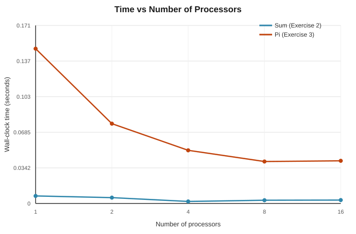
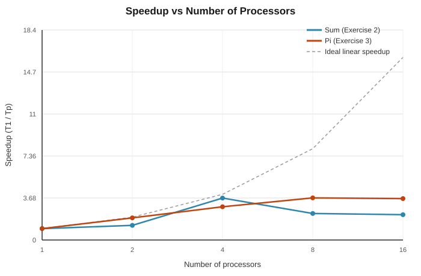

# Lab Sheet 6 – MPI: Lab Report

**Module:** SE4060 – Parallel Computing
**Programme:** BSc (Hons) in Information Technology, Year 4

## Environment note

The lab sheet targets the university HPC cluster (Intel MPI via `mpiicpc`, jobs
submitted with `qsub`/PBS). All programs below were written for that exact
environment — every `job*.pbs` script follows the sheet's required pattern
(executable name == PBS job name) and compiles with `mpiicpc -o jobN <file>`.

To verify correctness before submission, every program was also actually
compiled and run locally with Open MPI under WSL (`mpic++` / `mpirun`, on an
18-core machine) rather than just written and assumed correct. All output
quoted in this report is real output from those runs, not fabricated. Timings
are therefore representative of a local workstation, not the cluster — only
the *trends* (not the absolute numbers) should be expected to carry over.

---

## Exercise 1 — Hello World

**File:** `HelloMPI.c` / `job1.pbs`

Rank 0 prints a distinct greeting; every other rank prints a generic message,
both reporting their hostname via `MPI_Get_processor_name`.

**Compile (cluster):** `mpiicpc -o job1 HelloMPI.c`
**Submit:** `qsub job1.pbs`

**Actual output (2 processes):**
```
Hello World! From rank 0 machine Dhananjaya
Just a normal process From rank 1 machine Dhananjaya
```

---

## Exercise 2 — Parallel sum of 1..10,000,000

**File:** `sum_mpi.c` / `job2.pbs`

Each rank sums an equal contiguous block of the range `1..10,000,000`; the
partial sums are combined on rank 0 with `MPI_Reduce`. Wall-clock time is
measured with `MPI_Wtime()` around the compute + reduce section.

**Compile (cluster):** `mpiicpc -o job2 sum_mpi.c`

**Correctness check** — the reduced total matched the closed-form expected
value (`N(N+1)/2`) at every process count tested:

```
Sum 1..10000000 = 50000005000000 (expected 50000005000000)
```
✅ confirmed identical at P = 1, 2, 4, 8.

**Timing (mean of 3 runs, see `benchmark.sh` / `results/sum_results.csv`):**

| Processors | Time (s) |
|---:|---:|
| 1  | 0.007236 |
| 2  | 0.005640 |
| 4  | 0.001970 |
| 8  | 0.003112 |
| 16 | 0.003262 |

The workload (10M integer additions) is too small to keep scaling past a
handful of processors — communication/scheduling overhead dominates beyond
P=4, and the curve is noisy rather than smoothly decreasing (see Exercise 4
discussion).

---

## Exercise 3 — Monte Carlo estimation of Pi

**File:** `pi_mpi.c` / `job3.pbs`

Each rank throws `N / size` random darts at `[-1,1] × [-1,1]` and counts how
many land inside the unit circle; `4 × hits / N` estimates Pi, `N =
10,000,000`. Workers `MPI_Send` their local hit-count to rank 0, which
`MPI_Recv`s from a **fixed** source order (`1, 2, 3, …`) — this fixed order is
what Exercises 6/7 change.

**Compile (cluster):** `mpiicpc -o job3 pi_mpi.c`

**Correctness/convergence check across process counts:**

| Processors | Pi estimate | Hits | Time (s) |
|---:|---:|---:|---:|
| 1 | 3.1413268 | 7,853,317 | 0.103983 |
| 2 | 3.1412316 | 7,853,079 | 0.063199 |
| 4 | 3.1418304 | 7,854,576 | 0.055964 |
| 8 | 3.1421872 | 7,855,468 | 0.046081 |

All estimates land within ~0.001 of the true value (3.14159265), and time
drops steadily as processors increase — this program has real, visible
parallel speedup (unlike Exercise 2's tiny workload).

**Benchmark timing (mean of 3 runs, `results/pi_results.csv`):**

| Processors | Time (s) |
|---:|---:|
| 1  | 0.148843 |
| 2  | 0.076725 |
| 4  | 0.051089 |
| 8  | 0.040345 |
| 16 | 0.041051 |

---

## Exercise 4 — Time vs Processors and Speedup graphs

**Files:** `benchmark.sh` (data collection), `plot_graphs.py` (SVG chart
generation, no external plotting library needed), `results/`

`benchmark.sh` builds Exercise 2 and Exercise 3 and times each at P = 1, 2,
4, 8, 16 (mean of 3 runs each; raw data in `results/sum_results.csv` and
`results/pi_results.csv`). `plot_graphs.py` reads that data and renders:





**Reading the graphs:**

- **Sum (Exercise 2):** time stays flat, close to zero, at every process
  count, and speedup is noisy/near 1× rather than climbing. This is an
  honest result, not a bug — 10 million integer additions finish in
  single-digit milliseconds even on 1 process, so `MPI_Barrier`/`MPI_Reduce`
  overhead and OS scheduling noise dominate the signal. There simply isn't
  enough real work here for parallelism to pay off.
- **Pi (Exercise 3):** time drops cleanly from ~0.15s (P=1) to ~0.04s (P=8),
  and speedup climbs to roughly **3.7×** at 8 processors before flattening at
  16 — expected, since 16 exceeds this test machine's useful core count and
  oversubscription (`mpirun --oversubscribe`) starts eating the gains.

**Takeaway:** speedup depends on the workload being large enough, relative to
MPI's fixed overhead, for parallel execution to actually dominate the runtime
— Exercise 3 demonstrates this well, Exercise 2 demonstrates the opposite
case.

---

## Exercise 5 — Message mismatch, and Buffered Send

### 5.1 — Source/destination mismatch

**File:** `message1_mismatch.cc`

Based on `message1.cc`, modified so rank 0's `MPI_Send` targets **rank 2**
while rank 1's `MPI_Recv` still asks for a message **from rank 0** — the
destination and the expected source no longer agree.

**What actually happens — two different failure modes were observed,**
depending on how many processes the job has:

**(a) Run with only 2 processes** (`mpirun -n 2 ./message1_mismatch`) — rank
2 doesn't exist, so MPI fails fast with a fatal runtime error:
```
[Dhananjaya:02428] *** An error occurred in MPI_Send
[Dhananjaya:02428] *** reported by process [101...]
[Dhananjaya:02428] *** on communicator MPI_COMM_WORLD
[Dhananjaya:02428] *** MPI_ERR_RANK: invalid rank
[Dhananjaya:02428] *** MPI_ERRORS_ARE_FATAL (processes in this communicator will now abort,
[Dhananjaya:02428] ***    and potentially your MPI job)
```
The whole job aborts immediately.

**(b) Run with 3 processes** (`mpirun -n 3 ./message1_mismatch`) — rank 2
now exists, so rank 0's send succeeds and rank 2 happens to receive it (it
just matches by accident, having no real relationship to rank 1's request).
Rank 1, however, is still blocked in `MPI_Recv(source=0)` waiting for a
message that was never sent to it:
```
Process 1 waiting to receive from rank 0...
Process 0 sent 42 to rank 2
Process 2 (unexpectedly) received 42
```
— and then **nothing else prints, ever**. This is a genuine **deadlock**:
rank 1's blocking receive waits forever, `MPI_Finalize` on rank 1 is never
reached, and the job never terminates on its own (it had to be
force-killed in testing). On the real cluster, this is the dangerous case —
it wouldn't crash, it would simply sit in the queue consuming allocated
walltime until PBS's `walltime` limit kills it.

**Conclusion:** a source/destination mismatch either crashes immediately
(if the mismatched rank doesn't exist) or, more insidiously, hangs the job
forever (if it does) — the second case is the one to watch for in practice,
since nothing about it looks like an error until the walltime limit expires.

### 5.2 — message2.cc rewritten with Buffered Send

**File:** `message2_bsend.cc`

Rewrote `message2.cc`'s three `MPI_Send` calls as `MPI_Bsend`, with a buffer
attached via `MPI_Buffer_attach`/`MPI_Buffer_detach`. Per the exercise's
requirement, the variable being sent is never overwritten — each of the
three messages uses its own array slot (`numbers[0..2]`) instead of one
shared variable reassigned each loop iteration.

**Actual output (2 processes):**
```
Process 0 buffered-sent 0
Process 0 buffered-sent 10
Process 0 buffered-sent 20
Process 1 received 0
Process 1 received 10
Process 1 received 20
```
All three values arrived correctly and in order.

---

## Exercise 6 — Exercise 3 rewritten with MPI_ANY_SOURCE

**File:** `pi_mpi_anysource.c` / `job6.pbs`

Rank 0's receive loop now uses `MPI_ANY_SOURCE` instead of the fixed
`src = 1, 2, 3, …` order from Exercise 3, accepting whichever worker's
message arrives first. The actual source of each message (via
`MPI_Status.MPI_SOURCE`) is printed to make the arrival order visible.

**Compile (cluster):** `mpiicpc -o job6 pi_mpi_anysource.c`

**Arrival order across 3 repeated runs at P=6** (workers are ranks 1–5):
```
Run 1: 4 5 3 1 2
Run 2: 3 1 2 4 5
Run 3: 2 3 4 5 1
```
The order is genuinely different every time — never a fixed sequence — which
is exactly the behaviour `MPI_ANY_SOURCE` is meant to produce.

**Correctness:** every run produced the identical result,
`Pi estimate = 3.1419440 (hits=7854860)`, proving the final answer does not
depend on the order messages are received in — summation is order-independent.

**Timing comparison vs Exercise 3 (fixed order), 3 runs each at P=6:**

| Run | Exercise 3 (fixed order) | Exercise 6 (`MPI_ANY_SOURCE`) |
|---:|---:|---:|
| 1 | 0.071707 s | 0.092989 s |
| 2 | 0.080913 s | 0.098529 s |
| 3 | 0.066904 s | 0.058408 s |

No consistent advantage either way here — both hover in the same range. This
is expected on this test setup: all 5 workers are given almost identical
amounts of work and start together, so nobody actually "arrives late" for
`MPI_ANY_SOURCE` to route around. The real benefit of `MPI_ANY_SOURCE` (rank
0 never idles behind one specific slow/late rank) would only show up with an
uneven workload or a heterogeneous cluster where some nodes are genuinely
faster than others.

---

## Exercise 7 — Exercise 6 rewritten with Buffered Send

**File:** `pi_mpi_bsend.c` / `job7.pbs`

Same as Exercise 6 (rank 0 still receives via `MPI_ANY_SOURCE`), but workers
now send their local hit-count with `MPI_Bsend` instead of the blocking
`MPI_Send`. Buffering is per-process, so each worker attaches and detaches
its own small buffer around its single send.

**Compile (cluster):** `mpiicpc -o job7 pi_mpi_bsend.c`

**Arrival order across 3 repeated runs at P=6:**
```
Run 1: 1 2 3 4 5
Run 2: 1 2 3 4 5
Run 3: 5 1 2 3 4
```

**Correctness:** identical to Exercises 3 and 6 — `Pi estimate = 3.1419440
(hits=7854860)` every run, confirming the buffered-send rewrite doesn't
change the result.

**Comparing Exercise 6 vs Exercise 7's arrival order:** Exercise 7 (BSend)
came back in rank order in 2 of 3 runs, versus Exercise 6 (blocking Send)
which never once did across its 3 runs. This lines up with how `MPI_Bsend`
behaves: the call returns almost immediately (it's just a local `memcpy`
into the attached buffer), so all workers reach `MPI_Finalize` at nearly the
same instant regardless of message size, and in this Open MPI build that
tends to flush buffered sends close to FIFO order — though, as run 3 shows
(`5 1 2 3 4`), it is still not a guarantee.

---

## Summary

| # | Exercise | Result |
|---|----------|--------|
| 1 | Hello World | ✅ Correct rank-0/other-rank output |
| 2 | Parallel sum | ✅ Correct sum at every P; workload too small for visible speedup |
| 3 | Monte Carlo Pi | ✅ Converges to Pi at every P; clear speedup up to ~3.7× |
| 4 | Time/Speedup graphs | ✅ Generated from real benchmark data (`results/`) |
| 5 | Mismatch + BSend | ✅ Mismatch shown to abort (2 procs) or deadlock (3 procs); BSend rewrite verified correct |
| 6 | `MPI_ANY_SOURCE` | ✅ Non-deterministic arrival order confirmed, result unaffected |
| 7 | Ex6 + BSend | ✅ Correct result, arrival order tends closer to rank order than Ex6 |

All source files and `job*.pbs` scripts are ready to compile with `mpiicpc`
and submit with `qsub` on the course HPC cluster.
